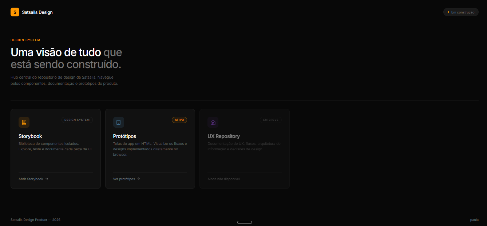
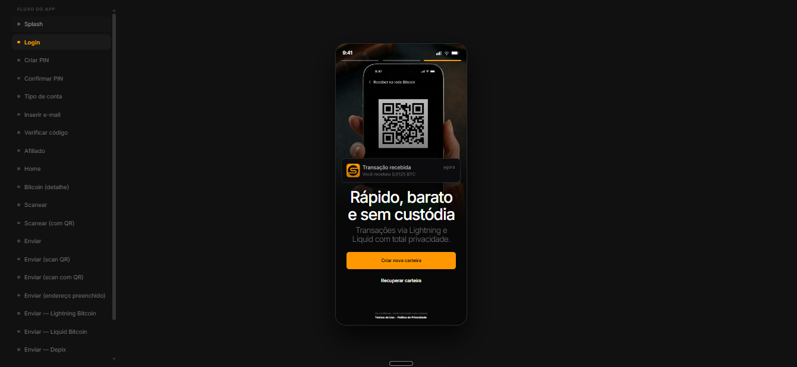
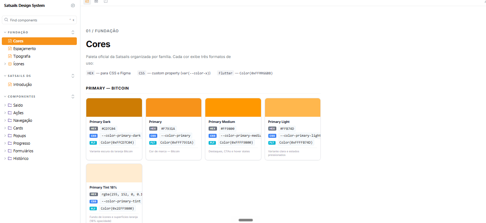

# Satsails — Design & Protótipo

Repositório de design da Satsails. Aqui você encontra o protótipo navegável do app e o Storybook com todos os componentes documentados.


---

## Os dois arquivos principais

### 1. Protótipo do app — `app.html`

Simula o fluxo real do aplicativo no navegador. É onde você vê as telas funcionando, clica nos botões e navega entre as páginas.

**Localização no repositório:**
```
UX-Repository/09-prototipo/app.html
```

Basta abrir o arquivo no navegador — não precisa instalar nada.
S
---


### 2. Storybook — documentação de componentes

Site interativo com todos os componentes do app: botões, inputs, cards, barras de progresso, navegação e muito mais. É a referência para o time de desenvolvimento implementar o sistema.

**Localização no repositório:**
```
Storybook/
```

Precisa de instalação (Node.js). Veja as instruções abaixo.

---


## Como baixar e usar

### Pré-requisito

Instale o [Node.js](https://nodejs.org) (versão 18 ou superior) caso ainda não tenha.

---

### Passo 1 — Baixar o repositório

**Opção A — com Git (recomendado):**
```bash
git clone https://github.com/eipaulavieira/satsails-designproduto.git
cd satsails-designproduto
```

**Opção B — download direto:**
1. Clique em **Code → Download ZIP** no GitHub
2. Descompacte o arquivo no seu computador

---

### Passo 2 — Abrir o protótipo

Navegue até a pasta `UX-Repository/09-prototipo/` e abra o arquivo `app.html` diretamente no navegador (Chrome ou Edge recomendados).

```
UX-Repository/
  09-prototipo/
    app.html   ← abra este arquivo
```

Sem instalação. Sem servidor. Só abrir e navegar.

---

### Passo 3 — Rodar o Storybook

No terminal, dentro da pasta do projeto:

```bash
cd Storybook
npm install
npm run storybook
```

Aguarde alguns segundos. O Storybook abre automaticamente em:

```
http://localhost:6006
```

---

## O que tem no Storybook

| Categoria | Componentes |
|---|---|
| **Navegação** | BottomNavBar (Home, Analíticas, Scan, Serviços, Histórico) |
| **Ações** | Botões, QuickActions, AssetQuickActions |
| **Saldo** | BalanceTotalCard, AssetBalanceCard |
| **Cards** | Card base, GlassCard |
| **Popups** | PopupCard, CurrencyPopupCard, FiatPopupCard |
| **Formulários** | Inputs do app (e-mail, afiliado, endereço, quantidade, telefone) |
| **Histórico** | TransactionHistoryCard |
| **Progresso** | Barra de progresso, Seletor de taxa Bitcoin |

---

## Outros arquivos do repositório

```
satsails-designproduto/
├── app.html                     ← protótipo navegável
├── Storybook/                   ← componentes React documentados
│   └── src/components/          ← código-fonte dos componentes
└── UX-Repository/               ← documentação de UX e design
    ├── 01-briefing-e-estrategia/
    ├── 03-design-system/        ← tokens de cor, tipografia e espaçamento
    ├── 05-branding-e-identidade/
    └── 09-prototipo/            ← app.html e imagens do protótipo
```

---

## Dúvidas

Abra uma issue no GitHub ou entre em contato com o time de design.
